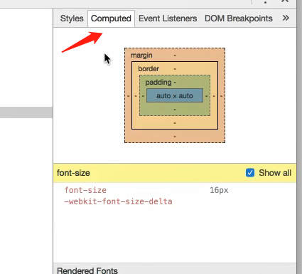
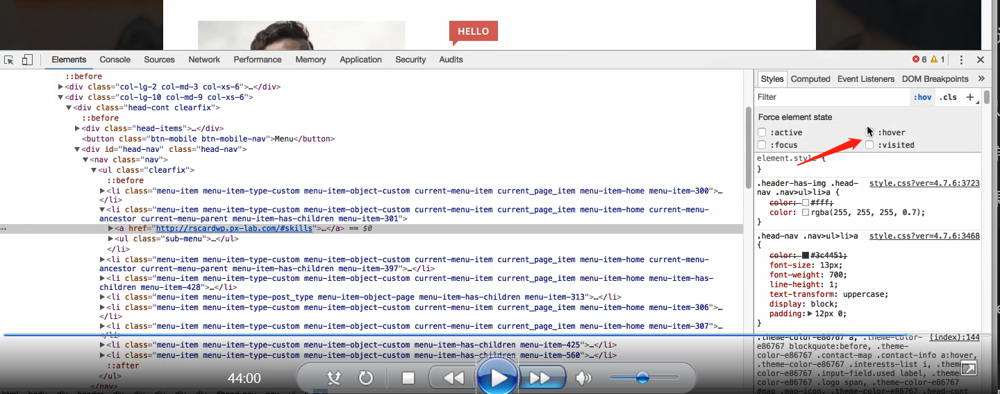

# CSS

**css学习资源：**
1.	Google: 关键词 MDN
2.	[CSS Tricks](https://css-tricks.com/)
3.	[Google: 阮一峰 css](https://www.google.com/search?q=%E9%98%AE%E4%B8%80%E5%B3%B0+css)
4.	[张鑫旭的 240 多篇 CSS 博客](http://www.zhangxinxu.com/wordpress/category/css/page/25/)
5.	[Codrops 炫酷 CSS 效果](https://tympanus.net/codrops/category/playground/)
6.	[CSS揭秘](http://www.ituring.com.cn/book/1695)
7.	[CSS 2.1 中文 spec](http://cndevdocs.com/)
8.	[Magic of CSS 免费在线书](http://adamschwartz.co/magic-of-css/)

中文学习资源只看大 V 的，英文资源看 CSS Tricks、MDN 和 Codrops。书的话作用不大，最权威的书其实是文档。
如果想快速上手，就先写小 demo 再学理论。
如果想一鸣惊人，就仔细看 CSS 规范文档。

----------------------------

## 制作导航栏

引入CSS的四种方式：

内联 style属性

style 标签

外部文件 css link

@import url(./style.css)


+ CSS如何把块横向排列：*float属性*
```html
<!-- float一定会有bug
    可以用一个类解决
 -->

.clearfix::after{
    content:'';
    display: block;
    clear: both;
}

<!-- 把这个类添加给所有要横向排列的元素的父元素上 -->
```
总结：*所有子元素浮动，它们的父元素加上clearfix*


+ 使用属性 list-style: none 去掉列表项默认的小黑点

+ margin：0；padding：0；去掉元素的默认内外边距

+ 使用截图工具可以量字体等的高度

+ 选择器写法：

```CSS
.topBar > nav > ul{
    ...
}
```
代表nav必须时topBar的子元素，ul必须是nav的子元素

+ style：展示所有样式 computed：展示计算出来的样式


+ 字体的颜色是由操作系统决定的

+ text-decoration：none；可以去除字体的下划线

+ 两个块之间的间距可以通过分别给两个块加左右外边距实现

+ font-weight：bold；可以把字体加粗

+ float：right/left；可以控制浮动的方向

+ 用hover方法实现悬停效果：

```css
.topNavBar > nav > ul > li > a:hover{
    /* border三要素 */
    border: 1px solid red;
}
```
+ 元素的边框也会影响元素的尺寸

+ 可以使用浏览器的调试功能，强制触发一个效果（hover）：


+ 可以用color：inherit；使字色跟其父标签一致

+ padding：；顺序：4：上右下左 2：（上下）（左右）