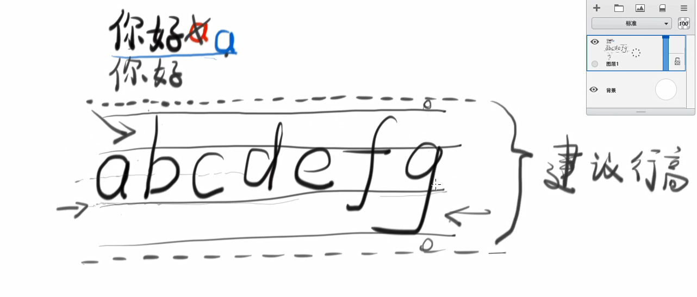

# CSS布局与定位

*课堂技巧：*
> + 当要在一个复杂的网页找一张图片时，可以右键检查->Network->image->Preview->刷新，依次查看图片，选择图片
> + 一个可以找到海量背景图片的网站：wallhaven
> + 调试技巧：可以给一个元素添加border样式以确定其位置 border：1px solid red;
> + 

## 文档流与高度

**一个块级元素的高度是由什么决定的？**

：div的高度由其内部文档流元素的高度总和决定

*文档流是什么？*

：文档内元素的流动方向

+ 内联元素从左往右流动，如果流动遇到阻碍会自动换行
+ 块元素从上往下流动（每一个块占一行）即使修改宽度也不会6
+ 当内联元素（span）内的单词过长，遇到阻碍时不换行，即这个单词不会被截断，可以添加word-break：break-all（或者break-word）使得单词按一定要求换行

**一个内联元素的高度是由什么决定的？**

+ 内联元素（span）中的文字的字高（font-size）指的是这个字体的最上端到最下端的距离，而span块的高度是字体的建议行高。