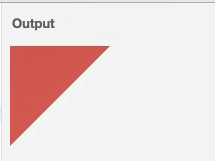

# CSS布局与定位

*课堂技巧：*
> + 当要在一个复杂的网页找一张图片时，可以右键检查->Network->image->Preview->刷新，依次查看图片，选择图片
> + 一个可以找到海量背景图片的网站：wallhaven
> + 调试技巧：可以给一个元素添加border样式以确定其位置 border：1px solid red;
> + 

## 文档流与高度

**一个块级元素的高度是由什么决定的？**

：div的高度由其内部文档流元素的高度总和决定

*文档流是什么？*

：文档内元素的流动方向

+ 内联元素从左往右流动，如果流动遇到阻碍会自动换行
+ 块元素从上往下流动（每一个块占一行）即使修改宽度也不会6
+ 当内联元素（span）内的单词过长，遇到阻碍时不换行，即这个单词不会被截断，可以添加word-break：break-all（或者break-word）使得单词按一定要求换行

**一个内联元素的高度是由什么决定的？**


+ 内联元素（span）中的文字的字高（font-size）指的是这个字体的最上端到最下端的距离，而span块的高度是字体的建议行高。

## 装饰banner

+ 轻易不要使用height和kwidth属性，容易出bug
+ 当给一个div这些属性： position：fixed ，这个div会脱离其当前的文档流，其下的元素会上浮，其父元素的高度会减少这个div的高度，通过指定top和left等属性可以控制它所固定的位置，但是div内的所有子元素会聚集 
+ 使用background-position：center center；可以让div的背景图片居中
+ 使用background-size：cover；让div的背景图片自适应div的大小

## 装饰userCard

+ max-width表示div的最大宽度，如果屏幕比maxwidth小，div会自适应
+ 设置一个有宽度的div水平居中：margin-left：auto；margin-right：auto；
+ span不接受设置宽高，改为：display：inline-block；
+ 在span内，让line-height和height一样，会使文本在块内水平居中
+ 也可以给块加内边距实现块内文本居中

+ 用CSS画一个三角形：
```CSS
div{
    border: 10px solid transparent;
    width: 0;
    height: 0;
    border-left-color: red;
    border-top-width: 0px;
}
```


+ 绝对定位：在子元素上写：position：absolute；在父元素上写：position：relative；即子元素相对于父元素定位，使子元素脱离了文档流，通过left，bottom等控制具体位置 
+ 在css最开始使用*{margin：0；padding：0；}删除所有元素的默认边距
+ 对dl中的dt和dd设置width：50%；是可以实现让一个dt和一个dl展现在一行里
+ 工具网站iconfont.cn可以快捷使用一些应用的图标
+ 将inline元素改为inline-block可以使它的边框完全包裹住它
+ 设置border-radius让边框成为圆形