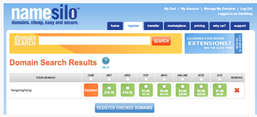
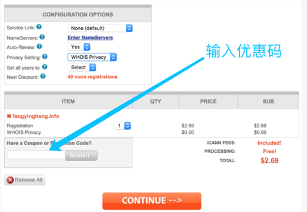
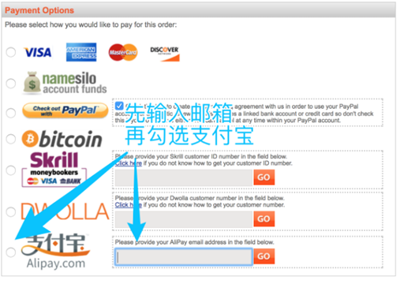

# HTML


## 购买域名

1.	进入 namesilo.com 搜索一个你喜欢的域名，然后你就会知道哪些域名是可以买的

2.	其中最低的价格是 .xyz 域名，价格只要 1.89 美元，折合人民币 12 块五毛（每年），是不是很便宜。不要急，还有更便宜的，后面会教你搜索优惠码。现在我们先确定域名，如果你对 .xyz 不满意，可以选 fangyinghang.info，.info 域名比 .xyz 稍微好看一点，当然你也可以选择 fangyinghang.me、fangyinghang.pro 等。
3.	选中你想要的域名，点击 REGISTER CHECKED DOMAINS 绿色按钮。
4.	别急着结账，有一个地方可以输入优惠码（如图）

去谷歌或者百度搜索「namesilo 优惠码」，填到里面，就可以优惠一美元！我搜到的优惠码是 onesaving。但是你要注意，一个用户只能使用一次优惠码，下次你再购买域名就没有优惠啦。
5.	用支付宝结账（一定要先输入邮箱，再选中支付宝，最后点击 go）


## 简历

**外观**

1.	在 dribbble.com 搜索 cv 或者 resume
2.	在五百丁(http://www.500d.me/) 直接花钱购买 Word 模板


这里选择：http://rscardwp.px-lab.com/

**内容**

1. 个人信息：姓名、性别、年龄、学校、所在城市、目标职位（千万不要写目标薪资）

2.	教育经历：不管你的学校好或者不好，都写上吧，因为面试官肯定会问的，写上可以避免浪费时间
3.	工作经历：如果有相关经验就写，如果没有相关经验就不写，或者一笔带过
4.	项目经验：这是我们的重点。我们就是要用项目来证明我们，所以我们至少要在毕业前准备 8 个项目，然后择优选择 4 到 6 个放在简历里。
可选部分有：
1.	开源代码：你的 GitHub 如果每天都有 commit 记录，可以加分不少
2.	博客链接：如果面试官看到你半年写了 20 篇博客，基本就会要你了
3.	外文翻译：如果你能翻译一些英文技术文章，也放在简历里吧
4.	他人评价：老师的评语、同学的夸奖等（截图）
5.	自拍：只要长得不丑，就一定要放头像，给人以亲切感。有头像的简历会比没有头像的简历更醒目。
6.	对公司业务的分析：表示你对这个公司很关注

不建议写到简历
1.	自我评价：没什么卵用
2.	对公司的喜爱：没什么卵用
3.	段子：没什么卵用
好了，接下来我们就开始学习 HTML 吧，因为一个在线简历显然会用到以下技术
1.	HTML
2.	CSS
3.	JS
4.	SVG
5.	AJAX


## 认识HTML

**HTML版本**
```
HTML 4.01
XHTML
HTML 5
HTML 5.1
```

html5不需要闭合

*搜索关键词 HTML spec 可以查看官方文档*


**DOCTYPE**

用来选择文档类型

html / head / body

```HTML
<!DOCTYPE html>
```

+ head内无内容时，可以不写head标签，浏览器会自动添加
+ body内没有注释时，body可以省略，浏览器会自动添加
+ html内没有注释时，html标签可以不写
+ title标签是必须写的
+ 一般都不省略

**常见标签**
```HTML
a
form
input
button
h1
p
ul （li） un-ordered list
ol （li）
small
strong
div
span
kbd     keyboard
video
audio
svg

dl  （dt dd） description list / term / definition

hr
br
```

除了div和span其他都有默认样式

**MDN**

Google：关键词 + MDN

