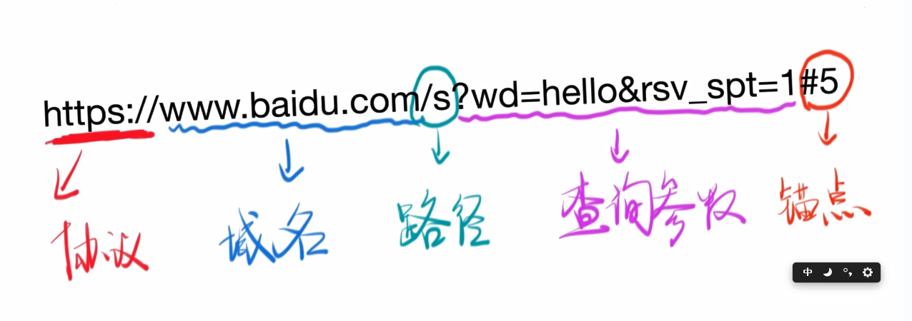
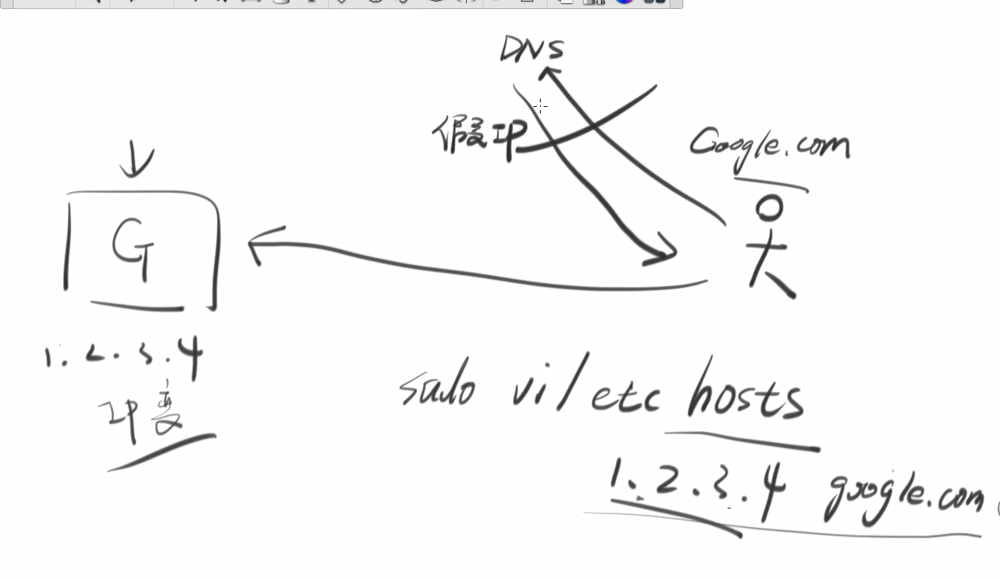
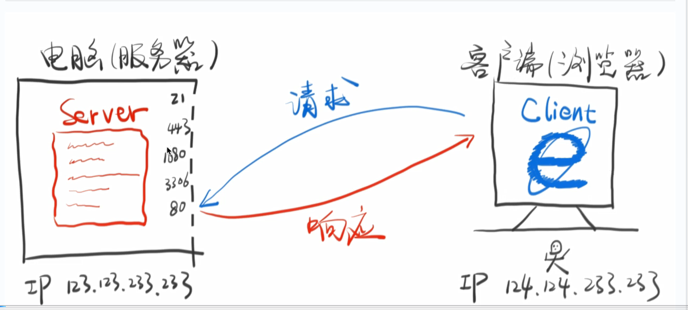

# HTTP入门

**WWWW的发明**

*URI* : 俗称网址

*HTTP* ：两个电脑之间传输内容的协议

*HTML* ： 超级文本，最初主要用来页面跳转

URL的作用是能让你访问一个页面，HTTP 的作用是让你能下载这个页面，HTML 的作用是让你能看懂这个页面。

**URI是什么？**

URI 分为 URL 和 URN，我们一般使用 URL 作为网址。

*URN* ： 

ISBN: 9787115275790 就是一个 URN，通过 URN 你可以确定一个「唯一的」资源，ISBN: 9787115275790 对应的资源的是《JavaScript 高级程序设计（第三版）》这本书。你去是介绍任何一个图书馆、书店，他们都知道是这本书。

*URL* ：

https://www.baidu.com/s?wd=hello&rsv_spt=1#5 就是一个 URL，通过 URL 你可以确定一个「唯一的」地址（网址）。




注：www.badui.com 和 baidu.com不是一个域名

www(三级域名).baidu(二级域名).com(一级域名)

**DNS**

对于DNS，输入域名，输出IP

命令行查询网址的ip的工具
```SHELL
nslookup baidu.com
ping baidu.com
```
过程：我 --> 路由器 --> 电信



**请求**

Server + Client + HTTP


端口号：

        21：FTP服务

        443：HTTPS服务

        1080：代理服务

        3306：MYSQL服务

        80：HTTP服务


•	浏览器负责发起请求

•	服务器在 80 端口接收请求

•	服务器负责返回内容（响应）

•	浏览器负责下载响应内容

*HTTP 的作用就是指导浏览器和服务器如何进行沟通。*

**请求示例**
```shell
curl -s -v -H "Trafal: xxx" -- "https://www.baidu.com"
```
用 curl 创造一个请求，并得到响应

请求内容是：
```
GET / HTTP/1.1  # 获取根目录，协议和版本号是HTTP/1.1
Host: www.baidu.com  #  要访问的域名
User-Agent: curl/7.54.0  # 用的什么软件发起的响应
Accept: */*  # 接受返回的任何内容
Trafal: xxx

```
第二次请求：
```shell
curl -X POST -s -v -H "Frank: xxx" -- "https://www.baidu.com"
```
请求的内容是：
```shell
POST / HTTP/1.1  # GET变为POST
Host: www.baidu.com
User-Agent: curl/7.54.0
Accept: */*
Frank: xxx

```
第三次请求：
```shell
curl -X POST -d "1234567890" -s -v -H "Frank: xxx" -- "https://www.baidu.com"
```
请求的内容是：
```shell
POST / HTTP/1.1
Host: www.baidu.com
User-Agent: curl/7.54.0
Accept: */*
Frank: xxx
Content-Length: 10
Content-Type: application/x-www-form-urlencoded

1234567890
```

GET：获取内容

POST：上传内容（如登陆时的账号密码）

**请求的格式**
```
1 动词 路径 协议/版本
2 Key1: value1
2 Key2: value2
2 Key3: value3
2 Content-Type: application/x-www-form-urlencoded
2 Host: www.baidu.com
2 User-Agent: curl/7.54.0
3 
4 要上传的数据
```

1.	请求最多包含四部分，最少包含三部分。（也就是说第四部分可以为空）
2.	第三部分永远都是一个回车（\n）
3.	动词有 GET POST PUT(整体更新) PATCH(部分更新) DELETE(删除) HEAD OPTIONS 等
4.	这里的路径包括「查询参数」，但不包括「锚点」
5.	如果你没有写路径，那么路径默认为 /
6.	第 2 部分中的 Content-Type 标注了第 4 部分的格式


**用Chrome发请求**

0.  在浏览器内右键检查
1.	打开 Network
2.	地址栏输入网址
3.	在 Network 点击，查看 request，点击「view source」
4.	点击「view source」
5.	点击「view source」
6.	点击「view source」
7.	终于点了？可以看到请求的前三部分了
8.	如果有请求的第四部分，那么在 FormData 或 Payload 里面可以看到

当下一步会刷新页面时，如果要查看请求，可以点击Preserve log 

**响应**

请求了之后，应该都能得到一个响应

上面三个请求示例，前两个请求对应的响应分别为：

```shell
HTTP/1.1 200 OK
Accept-Ranges: bytes
Cache-Control: private, no-cache, no-store, proxy-revalidate, no-transform
Connection: Keep-Alive
Content-Length: 2443    # 响应数据的长度
Content-Type: text/html     # 响应数据的类型
Date: Tue, 10 Oct 2017 09:14:05 GMT
Etag: "5886041d-98b"
Last-Modified: Mon, 23 Jan 2017 13:24:45 GMT
Pragma: no-cache
Server: bfe/1.0.8.18
Set-Cookie: BDORZ=27315; max-age=86400; domain=.baidu.com; path=/

<!DOCTYPE html>
<!--STATUS OK--><html> <head> 后面太长，省略了……
```
```shell
HTTP/1.1 302 Found
Connection: Keep-Alive
Content-Length: 17931
Content-Type: text/html
Date: Tue, 10 Oct 2017 09:19:47 GMT
Etag: "54d9749e-460b"
Server: bfe/1.0.8.18

<html>
<head>
<meta http-equiv="content-type" content="text/html;charset=utf-8"> 后面太长，省略了……
```

响应的格式
```shell
1 协议/版本号 状态码 状态解释
2 Key1: value1
2 Key2: value2
2 Content-Length: 17931
2 Content-Type: text/html
3
4 要下载的内容
```

状态码：

•	1xx 不常用

•	2xx 表示成功

•	3xx 表示滚吧（301:永久离开，302：临时离开）

•	4xx 表示你丫错了

•	5xx 表示好吧，我错了

•	状态解释没什么用


•	第 2 部分中的 Content-Type 标注了第 4 部分的格式

•	第 2 部分中的 Content-Type 遵循 MIME 规范

**用Chrome查看响应**

1.	打开 Network
2.	输入网址
3.	选中第一个响应
4.	查看 Response Headers，点击「view source」，点击「view source」，点击「view source」
5.	你会看到响应的前两部分
6.	查看 Response 或者 Preview，你会看到响应的第 4 部分
